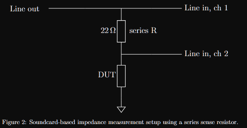

# Speakeasy 🔈

**AGPLv3 powerhouse for electroacoustic modelling – scalable, physics‑first, and open.**

[](https://www.gnu.org/licenses/agpl-3.0)
[](https://www.mathworks.com)
[](https://www.python.org)

Speakeasy is a **research‑grade toolbox** for loudspeaker modelling, measurement, and parameter inversion.  
It combines a calibrated soundcard‑based impedance analyser, a full‑wave Boundary Element Method (BEM) radiation model, and a **Bayesian inverse solver** that gives you confidence intervals on Thiele‑Small parameters – all in a modular, AGPLv3‑licensed codebase.

---

## ✨ What can it do?

### 1. Calibrated soundcard Bode plotter (Python) – *release*
Turn any PC with a stereo line‑in/out into an **accurate impedance measurement rig**.

- 3‑point calibration (channel mismatch, open, short) stored in a `.cal` file.
- Coherence‑weighted estimation of transfer function.
- Automatically saves `.csv` with magnitude, phase, and coherence.
- **Example:** measure a loudspeaker’s electrical impedance from 20 Hz to 20 kHz with a simple voltage divider (one sense resistor).

### 2. Forward Thiele‑Small solver (MATLAB) – *release*
Predict **SPL, impedance, cone displacement, and efficiency** from a complete set of driver parameters.

- Arbitrary baffle geometry via BEM (circle, square, or any `.stl` mesh).
- Enclosure models: infinite baffle, sealed box (ported & modal planned).
- Outputs: electrical impedance `Ze`, on‑axis pressure, velocity, and true acoustic efficiency.
- **Example:** design a sealed‑box subwoofer and visualise its displacement‑limited power handling.

### 3. Inverse problem solver (MATLAB) – *experimental*
Recover **all T/S parameters from a single electrical impedance measurement** – with **95% confidence intervals**.

- Two‑pass Bayesian MAP fit with **SVD‑shaped priors** that handle the notorious `Rms` ⇔ `Cms` ambiguity.
- Automatically estimates `fs0` from the measured phase zero‑crossing.
- Outputs: fitted `Re, Le, Bl, Rms, Mms, Cms` plus derived `Qms, Qes, Qts, Vas` and their uncertainties.
- **Example:** measure a raw driver’s impedance, run `main_inverse.m`, and get a complete parameter set with honest error bars.

---

## 🔬 What makes it special?

This is **not** yet another T/S calculator. Speakeasy was built on a strict physical contract:

1. ACOUSTIC MEDIUM – Linear, inviscid, isentropic (Helmholtz)
2. RADIATION MODEL – Surface BEM, arbitrary geometry
3. STRUCTURAL MODEL – Rigid piston (SDOF) – extensible
4. ENCLOSURE MODEL – Lumped mechanical impedance only
5. COUPLING – Bl product, acoustic loading as mechanical impedance
6. IMPORTANT RULE:
      - Geometry → radiation operators ONLY
      - Enclosure → lumped mechanical impedance ONLY
      - No hidden coupling paths


# SpeakEasy: A modular, open‑source loudspeaker simulation and parameter extraction toolkit.

## What can SpeakEasy do?
- Forward simulation: given T/S parameters (plus extended parameters like voice‑coil inductance and frequency‑dependent radiation), predict SPL, impedance, displacement, and efficiency.
- Inverse parameter extraction: from a simple electrical impedance measurement (soundcard + series resistor), recover all T/S parameters in one shot.

All code is released under the AGPLv3 license – you can use, modify, and share it freely, but any derivative work or service must also be open source.


## Prerequisites:

- MATLAB (R2018b or newer recommended)
- Python (newest)
- Soundcard with at least one line output and one line input (a standard USB audio interface works perfectly).
⚠️ Do not use a microphone‑only input, two input channels are needed. 

## Getting Started:

0. Read the docs
   ```
   It is strongly recommended to understand the basics before using the tools.
   Read both the guide and the derivation (preprint) papers. 
   ```
   
2. Clone the repository
   ```
   git clone https://github.com/theIvanR/speakeasy.git
   cd speakeasy
   ```

4. Install Dependencies
   ```
   MATLAB (R2018b or newer recommended)
   Python (newest)
   ```
   
6. Set up MATLAB path
   ```
   In MATLAB, navigate to the repository folder and add the subfolders to the path:
   addpath(genpath(pwd));
   ```

## Forward Problem:

Goal: Predict SPL, impedance, and other performance metrics from a set of T/S (plus) parameters.

1. Open MATLAB and run:
   forwards_ts_to_plots

2. A dialog will appear – select the driver parameter file or enter parameters manually.

3. Choose simulation options:
   - Configuration: single driver, isobaric series, parallel, or series‑parallel.
   - Enclosure: infinite baffle or sealed box.
   - Radiation model: constant, bessel, or bem.

4. The script will produce:
   - SPL (dB) vs frequency
   - Cone displacement
   - Electrical impedance magnitude & phase
   - Efficiency and power plots

All results are also saved to the results/ folder.


## Inverse Problem:



Goal: Determine T/S parameters from a real driver using only an electrical impedance measurement.

Step 1: Measure the impedance with make_bode_plots.py

1. Connect the measurement circuit:
```yaml
Soundcard line out --> series resistor (e.g., 22 Ω) --> driver --> soundcard line in (channel 2)
                 |
                 --> soundcard line in (channel 1)
```

3. Run the measurement script:
   python bode_plotter.py

Step 2: Fit parameters with inverse_speaker_to_ts.m

1. In MATLAB, run:
   inverse_speaker_to_ts

2. Select the CSV file from Step 1.

3. Enter an initial guess for the parameters.

4. The Levenberg‑Marquardt optimizer will fit the model to your measured impedance, producing a complete set of T/S parameters.

5. Results are displayed and saved as a JSON file for later use in the forward problem.


## Contributing:

Contributions are welcome! Please open an issue or submit a pull request.


Enjoy!
